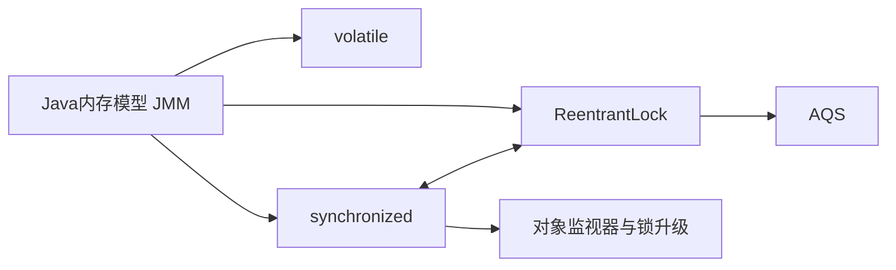

# Java 并发导航

> 复习路径：共享变量问题 → JMM → 可见性与有序性 → 锁与同步 → 线程协作 → 线程池与异步。

## 一、并发问题的基础

- [[01-Java 内存模型（JMM）是什么？]]
- [[02-Volatile]]
- [[03-Synchronized是什么]]
- [[04-ReentrantLock是什么]]
- AQS

## 二、锁与同步

### 核心问题

- [[03-Synchronized是什么]]
- [[04-ReentrantLock是什么]]
- AQS

### 复习关系

- [[03-Synchronized是什么]]：重点理解 JVM 内置锁、锁住的对象、互斥、可见性、可重入和锁升级。
- [[04-ReentrantLock是什么]]：重点理解显式加锁、AQS、公平锁、可中断、超时和 Condition。
- `Synchronized` 与 `ReentrantLock` 不是二选一的重复笔记，而是两个独立问题，通过双向链接进行比较。

## 三、线程隔离与线程安全

- [[05-ThreadLocal会造成内存泄露吗]]
- ConcurrentHashMap
- CopyOnWriteArrayList
- 原子类与 CAS
- 乐观锁与悲观锁

## 四、线程协作与线程池

- 线程池提交任务后的执行流程
- 线程池核心参数与拒绝策略
- CompletableFuture 常见问题
- wait、notify 与 Condition
- 死锁如何排查

## 五、复习顺序

1. 先理解 [[01-Java 内存模型（JMM）是什么？]] 解决什么问题。
2. 再复习 [[02-Volatile]]，理解可见性和有序性。
3. 然后复习 [[03-Synchronized是什么]]，理解互斥与锁。
4. 接着复习 [[04-ReentrantLock是什么]]，理解显式锁和 AQS。
5. 最后补充 ThreadLocal、线程池、CAS、死锁和异步编程。

## 待整理文档

- [[05-ThreadLocal会造成内存泄露吗]]
- AQS是什么？
- 线程池提交任务后的执行流程是什么？
- CompletableFuture有哪些坑？
- 死锁如何排查？
