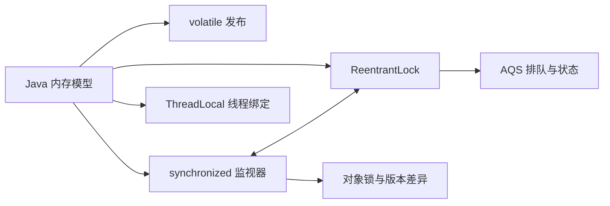

# 00 Java并发导航

## 01 复习问题

- [[八股/01-Java/03-Java并发/01-Java 内存模型（JMM）是什么？|Java 内存模型（JMM）是什么？]]
- [[八股/01-Java/03-Java并发/02-Volatile|Volatile]]
- [[八股/01-Java/03-Java并发/03-Synchronized是什么|Synchronized是什么]]
- [[八股/01-Java/03-Java并发/04-ReentrantLock是什么|ReentrantLock是什么]]
- [[八股/01-Java/03-Java并发/05-ThreadLocal会造成内存泄露吗|ThreadLocal会造成内存泄露吗]]
- [[八股/01-Java/03-Java并发/06-乐观锁与悲观锁的核心区别是什么？分别如何实现（CAS、synchronized），各自适用于什么场景|乐观锁与悲观锁的核心区别是什么？分别如何实现（CAS、synchronized），各自适用于什么场景]]
- [[八股/01-Java/03-Java并发/07-什么是 AQS|什么是 AQS]]
- [[八股/01-Java/03-Java并发/08-死锁如何排查|死锁如何排查]]
- [[八股/01-Java/03-Java并发/09-CompletableFuture 常见坑|CompletableFuture 常见坑]]
- [[八股/01-Java/03-Java并发/10-Java 21 虚拟线程是什么？适合什么场景|Java 21 虚拟线程是什么？适合什么场景]]

## 02 上层导航

- [[八股/01-Java/00-Java导航|Java导航]]
- [[八股/00-总导航|八股总导航]]

## 03 推荐复习路径

先理解共享变量为什么出错，再用 JMM 推导可见性；随后区分 volatile 发布、监视器互斥和显式锁，最后学习线程隔离、执行器与异步协作。单篇解释相应机制，对比关系通过相关问题往返阅读。

ThreadLocal 的关联是为了区分线程绑定与共享同步，并不表示其隔离机制由 volatile 或锁提供。线程池与虚拟线程的调度模型另行复习。
